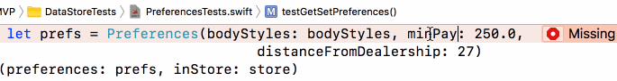

# Xcode Shroud

This is an opaque floating window that I use to cover the Xcode9 jump bar,
which flashes like a madman whenever I edit anything.  rdar://32834285.

This is a simple cocoa program that makes a black window that floats above most
everything, so you can resize it and position it wherever you want:

It uses Cocoa's built-in window placement features, which aren't terribly reliable,
but seems to be working so far for me.

Double-click to make the window transparent enough to see through it.

This code is public domain.  Only took me about a half hour to write :-)

## So What's the problem?

You can ignore the blinking of the code - just notice the jump bar.  For me,
this happens every time I pause for more than a second or two. HEY!  LOOK AT ME
I'M UP HERE!  FORGET THAT CODE YOU'RE TRYING TO CONCENTRATE ON AND LOOK AT ME!!!!

Love, 
++md

