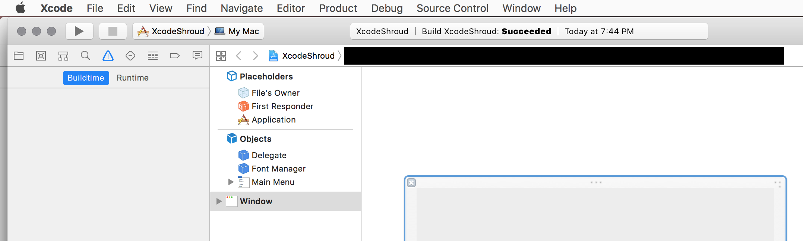

# Xcode Shroud

This is an opaque floating window that I use to cover the Xcode9 jump bar,
which flashes like a madman whenever I edit anything.  rdar://32834285.

This is a simple cocoa program that makes a black window that floats above most
everything, so you can resize it and position it wherever you want:

It uses Cocoa's built-in window placement features, which aren't terribly reliable,
but seems to be working so far for me.

This code is public domain.  Only took me about a half hour to write :-)

Love, 
++md

